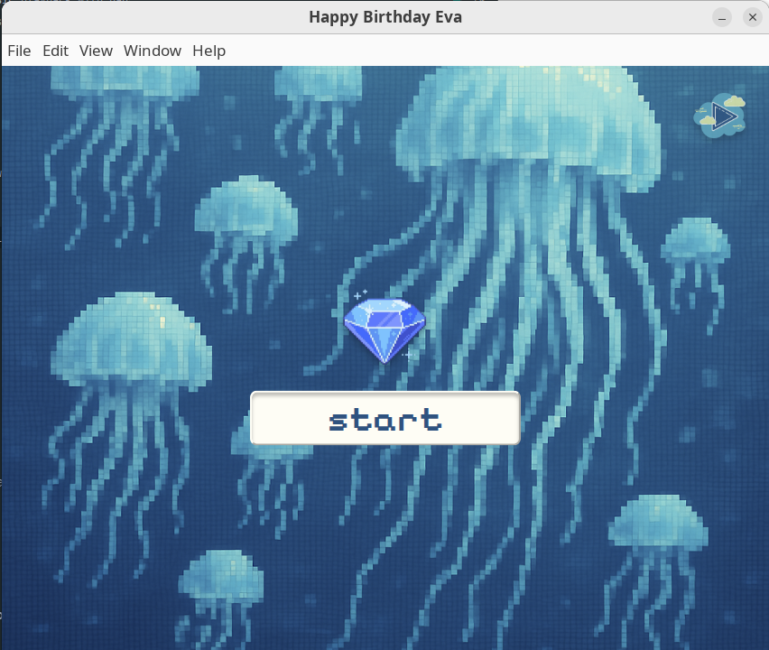
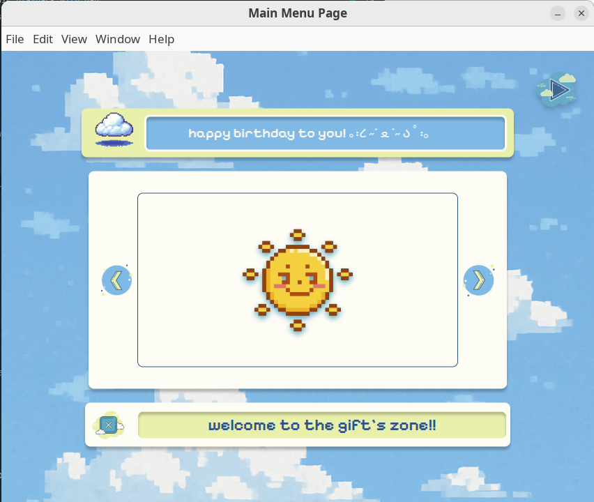

# e-card to sister's birthday

An electronic greeting card in the form of an application on Electron in honor of my sister's birthday (✿╹◡╹)

###
### For example: start page

###
### For example: menu page 



## Installation:

```
 git clone https://github.com/vankaspr/E-card.git
 cd E-card
 npm install
 npm start
```

## Opportunities:
- Background music playback with pause option
- The menu has several options, including browsing your favorite TikToks, listening to cool, uplifting music, and a moodboard with associations about how I see my sister.
- Confetti. **I'm not kidding.**

## Build:

```
 # windows 
 npm run build-win
 
 # linux 
 npm run build-linux
```

### Credits:
All media are taken from open sources or generated by AI (_Pinterest, Icons8, Zvukipro, The Fonts, TikTok_).

